
# Why Food for Good?

Do you often struggle with making good food choices? Do you feel torn between seemingly “healthy” and “unhealthy” food? Are you attracted by the flashy colors of sugary snacks?

<label style="font-size: 10px">Fig 1 : Juicy cake</label>

Are you repulsed by the seemingly boring healthy food?
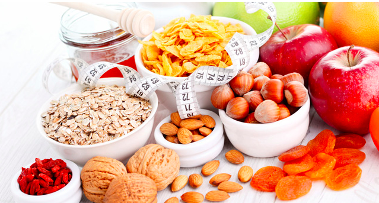

<label style="font-size: 10px">Fig 2 : Healthy food</label>

In an era where transparency is needed and requested more than ever, but not always provided, it is important to know what we put in our plates. Food is at the core of our daily survival and is usually the factor that has the biggest influence on our health. Its effects are so wide that they are not always known and are often controversial.  

Maybe this is why you usually feel overwhelmed with all the available information, that is often contradictory? Why you often hesitate numerous times in the supermarket aisles?

Lucky for you, nowadays, we have access to many sources of documentation that can help us make better choices. One of those is open source, made by a non-profit organization and not influenced by the industry: the Open Food Facts Database.
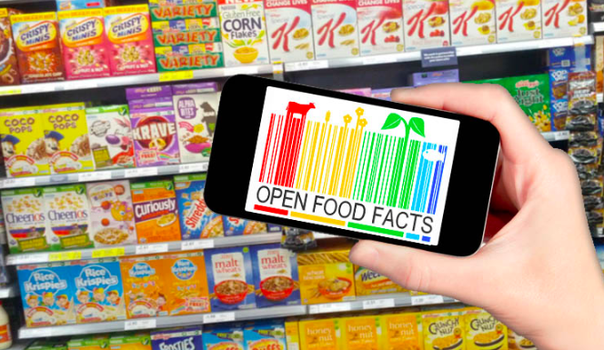

<label style="font-size: 10px">Fig 3 : Open Food Facts in use</label>

# Dataset

The dataset used in this study is acquired from [Open Food Fact](https://world.openfoodfacts.org/data). Open Food Facts is a food products database made by everyone, for everyone. It is a free, online and crowdsourced database of food products from around the world. Hence, you can use it to make better food choices, and as it is open data, anyone can re-use it for any purpose.

In May 2016, the database contained more than 80,000 products from 141 countries. In June 2017,  this number rose to 330,000, thanks to the growing ecosystem of apps and open data imports from various countries.

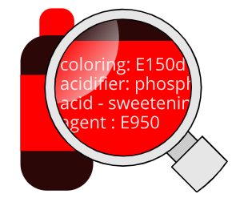

<label style="font-size: 10px">Fig 4 : Additives in a product</label>

The dataset contained the food products database, in particular the following features:

* Generalities: these fields contain general informations on the products of our dataset, their dates, modifications, product name, code bar of the product, the quantity, etc.

* Tags: these fields contain information about packaging, brands, categories, countries, stores, manufactories and other interesting tags.

* Ingredients: these fields contain features about ingredients.

* Nutrition facts: these fields contain anything that relates to nutriments, macros and micros.

# Approach and Data Preprocessing :

In this project, we are going to dig deeply into the several pieces of information we have about the products that are registered in the open food fact dataset. Our goal is to identify the impact of the food products that we consume on the Human Health, focusing on the composition of the food we eat, based on the different macros these different types of food provide and other concerning ingredients. The ultimate purpose being making better and healthier food choices.

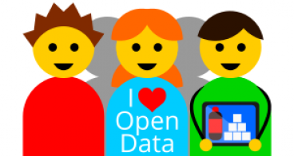

<label style="font-size: 10px">Fig 5 : We love Open Data!</label>

The dataset contains roughly 700 000 lines and 173 columns, with a high and prevalent number of NaN values, and since all the columns have at least one NaN value in them, we decided to only drop them after importing the important columns. So at each step of our study, we removed the NaNs only after extracting the fields needed, in order to stay accurate through the analysis.

Furthermore, since OpenFoodFacts is an open and public database that can be used by everyone and without the check of the user inputs, a lot of errors occur when entering the features. Then, we had to look closer at the given data and analyze possible false data. We tried to reduce some mistakes by correcting obvious errors. For example, many errors concern the energy a product contains, with incoherent high values for that energy, or even also negative values.

# Data Analysis

## Decode labels

Just like what we said before, we are living in a world full of a variety of food products. Our immersion in this variety makes it difficult for us to make choices about the food we eat. Indeed, we would like to eat delicious healthy food, and this is the main problem. Most of the time, what we consider delicious is unhealthy and has bad effects on our mood, fatigue,  and life longevity.

So how can we make a good balance in our choices of healthy food?

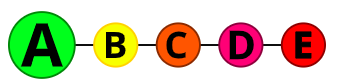

<label style="font-size: 10px">Fig 6 : The nutrition grades scale</label>

In order to go into more details, our dataset provides us with an interesting nutritional score. Our scores vary from “A” to “E”, “A” being the best score a product can have and “E” the worst one. We also have several categories of products. Let’s zoom in the scores of the products for our dominant daily food categories :

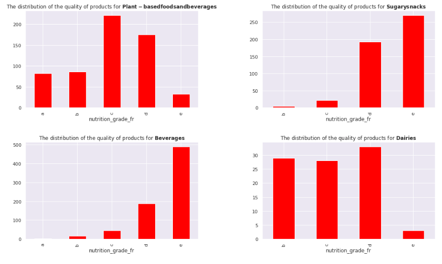

This first approach shows us that the "Plant-based-and-Beverages" products have the most products with "A". However, this same category also has a good amount of bad products, it is balanced/centered around "C". Beverages and Sugary snacks seem to be the worst products and Dairies are a little bit balanced containing lots of products in "B" and "C" and "D" and some products in "E" too.

## Compare and choose

Through our analysis, we noticed that products containing palm oil/additives are usually considered as unhealthy, let’s look on the top 3 categories containing additives/palm oil and the distribution of their nutritional scores :

#### Top 3 categories containing additives:

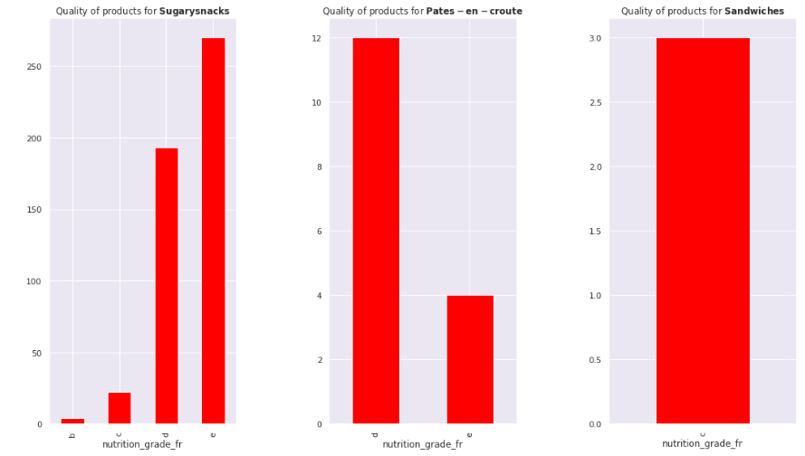

#### Top 3 categories containing palm oil:

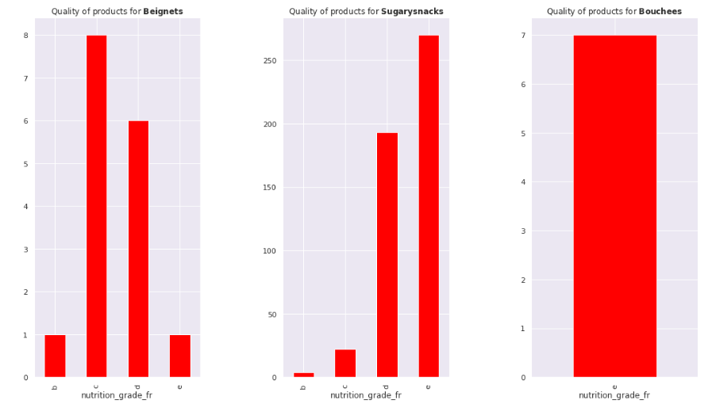

So we clearly see that products having lots of amounts of palm oil and additives are usually ranked in a bad way. However, some of them seem to have exceptions which lead us to look into other features. These features are in general the several macronutrients (Proteins, fat and carbohydrates) but also in particular sugar and salt.

We noticed that sugar, salt, fat and proteins are usually the nutrients that drive our concern over healthy/unhealthy food. Amounts of Carbohydrates do not differ that much from unhealthy to healthy food which is reasonable because carbohydrates are coming either from starchy food/pure sugar or fibres. Some of them (coming from starchy food) will have the tendency to be processed slowly and stored as fat slower than others (pure sugar). That's why we don't see any significant difference between the healthy/unhealthy products over carbohydrates.

Let’s have a look at the features on which we see some slight differences  (sugar, salt, fat and proteins):

#### Density distribution of Fat over the products:

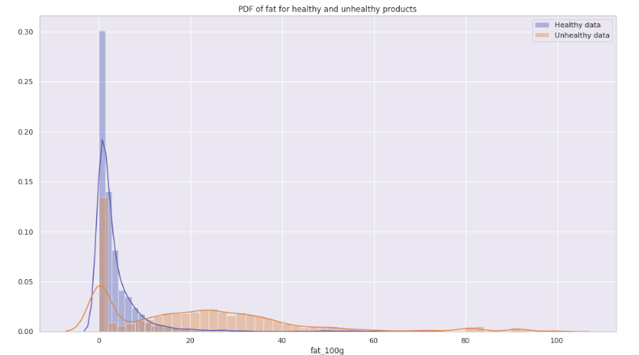

#### Density distribution of Protein over the products:

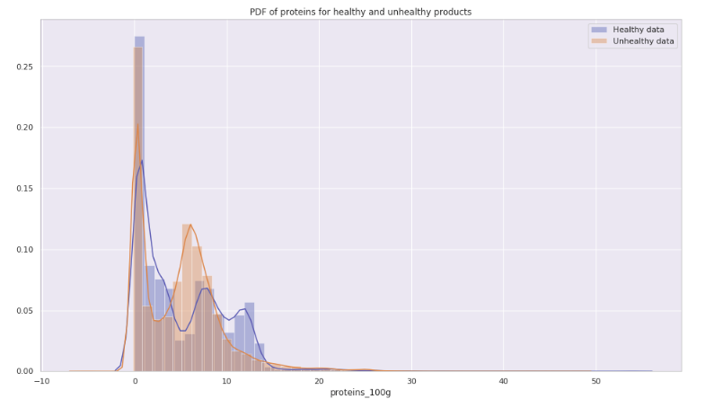

#### Density distribution of Sugar over the products:

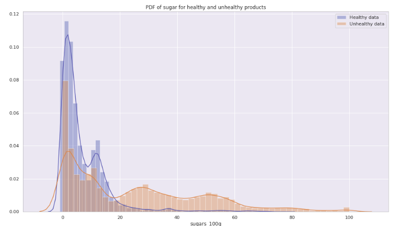

#### Quantity of Salt over the products:

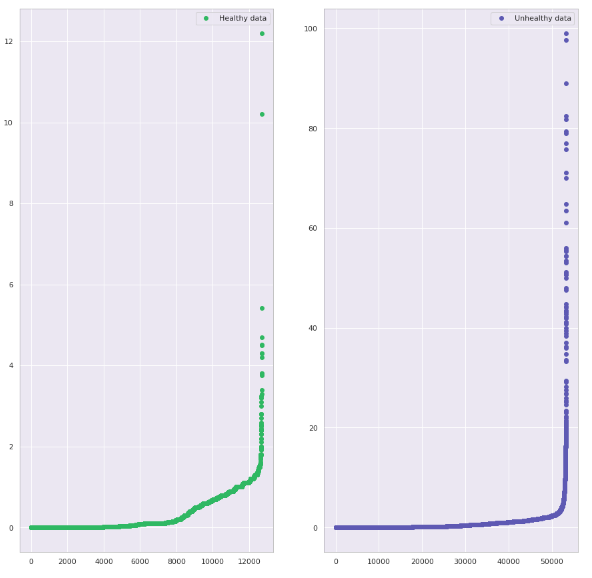

So we clearly notice that unhealthy products seem to have lots of amounts of sugar, fat and salt compared to healthy ones. Concerning Proteins, healthy products are among the ones that have the highest amounts of proteins in them.

## How to make better food choices?

Let's have a preview on the different good products that we find:

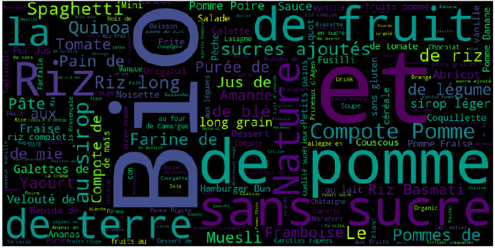

<label style="font-size: 10px">Fig 7 : WordMap of healthy products</label>

In general, we can advice customers who want to eat sugary foods and products that usually seem to be unhealthy to stick to some good labels (organic, lactose free, bio ...) in their food choices. Not only good labels but also stick to products that are plant based, non processed, avoid additives and palm oil, the word map resumes the choice of products in a good way. Furthermore, one can innove and make some good home made healthy recipes from these healthy products. One good step to follow up on our analysis is to propose these healthy recipes and mixtures of good products in order to produce healthy delicious non industrial home made food.

 Knowledge is power. Food knowledge is power to eat better! 

<label style="font-size: 10px">Fig 8 : Open Food Fact used for scanning the products</label>

