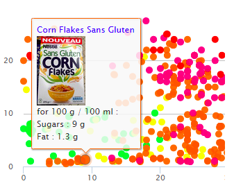

# Why Food for Good?

Do you often struggle with making good food choices? Do you feel torn between seemingly “healthy” and “unhealthy” food? Are you attracted by the flashy colors of sugary snacks and repulsed by the seemingly boring healthy food?
In an era where transparency is needed and requested more than ever, but not always provided, it is important to know what we put in our plates. Food is at the core of our daily survival and is usually the factor that has the biggest influence on our health. Its effects are so wide that they are not always known and are often controversial.
Maybe this is why you usually feel overwhelmed with all the available information, that is often contradictory? Why you often hesitate numerous times in the supermarket aisles?
Lucky for you, nowadays, we have access to many sources of documentation that can help us make better choices. One of those is open source, made by a non-profit organization and not influenced by the industry: the [Open Food Facts Database](https://world.openfoodfacts.org/data)

# Dataset

The dataset used in this study is acquired from [Open Food Fact](https://world.openfoodfacts.org/data). Open Food Facts is a food products database made by everyone, for everyone. It is a free, online and crowdsourced database of food products from around the world. Hence, you can use it to make better food choices, and as it is open data, anyone can re-use it for any purpose.

In May 2016, its database contained more than 80,000 products from 141 countries. In June 2017,  this number rose to 330,000, thanks to the growing ecosystem of apps and open data imports from various countries.

The dataset contained the food products database in particular the following features:

* Generalities: these fields contain general informations on the products of our dataset, their dates, modifications, product name, code bar of the product, the quantity, etc.

* Tags: these fields contain information about packaging, brands, categories, countries, stores, manufactories and other interesting tags.

* Ingredients: these fields contain features about ingredients.

* Nutrition facts: these fields contain anything that relates to nutriments, macros and micros.

# Approach and Data Preprocessing :

In this project, we are going to dig deeply into the several pieces of information we have about the products that are registered in the open food fact dataset. Our goal is to identify the impact of the food products that we consume on the Human Health, focusing on the composition of the food we eat, based on the different macros these different types of food provide and also on their micros. The ultimate purpose being making better and healthier food choices.

The dataset contains roughly 700 000 lines and 173 columns, with a high and prevalent number of NaN values, and since all the columns have at least one NaN value in them, we decided to only drop them after importing the important columns. So at each step of our study, we removed the NaNs only after extracting the fields needed, in order to stay accurate through the analysis. Furthermore, since OpenFoodFacts is an open and public database that can be used by everyone and without the check of the user inputs, a lot of errors occurs when entering the features. Then, we had to look closer at the given data and analyze possible false data. We tried to reduce some mistakes by correcting obvious errors. For example, many errors concern the energy a product contains, with incoherent high values for that energy, or even also negative values.

# Data Analysis

## How to make better food choices?

Just like what we said before, we are living in a world full of a variety of food products. Our immersion in this variety makes it difficult for us to make choices about the food we eat. Indeed, we would like to eat delicious healthy food, and this is the main problem. Most of the time, what we consider delicious is usually unhealthy, it has bad effects on our health, fatigue, mood and life longevity. So how can we make a good balance in our choices of healthy food?

In order to go in more details, our dataset provides us with an interesting nutritional score. Our scores vary from “A” to “E”, “A” being the best score a product can have and “E” the worst one. We also have several categories of products. Let’s zoom in the scores of the products for our dominant daily food categories :

Through our analysis, we noticed that products containing palm oil/additives are usually considered as unhealthy, let’s look on the top 3 categories containing additives/palm oil and the distribution of their nutritional scores :

So we clearly see that products having lots of amounts of palm oil and additives are usually ranked in a bad way. However, some of them seem to have exceptions which lead us to look into other features. These features are in general the several macronutrients (Proteins, fat and carbohydrates) but also in particular sugar and salt.

We noticed that sugar, salt, fat and proteins are mainly the nutriments that drive our concern over healthy/unhealthy food. Carbohydrates do not differ that much from unhealthy to healthy food which is reasonable because carbohydrates are coming either from starchy food/pure sugar or fibres. Some of them (coming from starchy food) will have the tendency to be processed slowly and stored as fat slower than others (pure sugar). That's why we don't see any significant difference between the healthy/unhealthy products over carbohydrates. Let’s have look on the feature son which we see some slight differences  (sugar, salt, fat and proteins):

So we clearly notice that unhealthy products seem to have lots of amount of sugar, fat and salt compared to healthy ones. Concerning Proteins, healthy products have the products that have the highest amounts of proteins in it.

